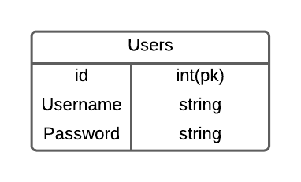

<h1 align = center> Prueba Tecnica Hyperflex </h1>

## Descripción

  Aplicación API REST para gestión de usuarios, desarrollada con el Framework Django, basado en Python. Tiene todas las aplicaciones CRUD funcionales en los     siguientes directorios:

- <b>CREATE:</b> home/new-user  
- <b>READ:</b> home/  
- <b>UPDATE:</b> home/<id_user>/edit-user/  
- <b>DELETE:</b> home/<id_user>/delete-user/  

## Base de Datos

  Para el desarrollo de esta prueba técnica, se utilizó la Base de Datos SQLite, instalada por defecto en el framework de Django. La Base de Datos creada para almacenar usuarios cuenta con 3 campos, teniendo asi el siguiente <b> Modelo Entidad-Relación: </b>
  

    
  

## Carpetas del Proyecto

- <b>applications:</b> Contiene el código de la aplicación para el Gestor de Usuarios, creación de las Vistas, creación y conexión con la Base de Datos, y los archivos de configuración necesarios para el funcionamiento del proyecto.  
- <b>templates:</b> Contiene las plantillas HTML, y los archivos CSS y Javascript, para el Frontend de la aplicación.  
- <b>Users:</b> Contiene los archivos de configuración generados por Django.  
